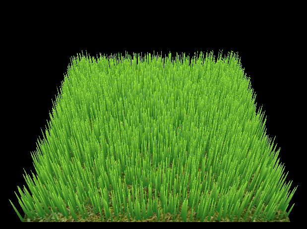
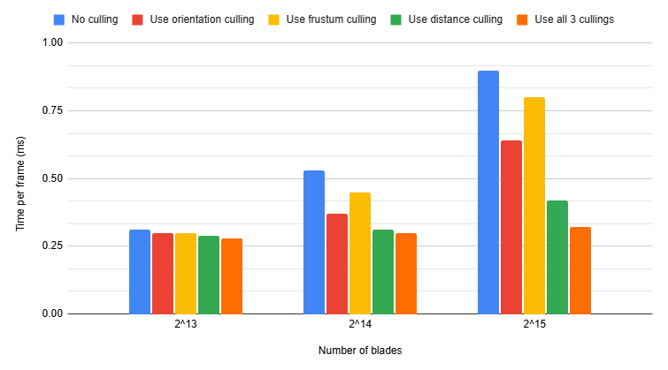
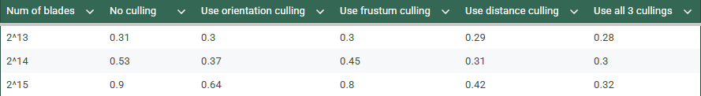
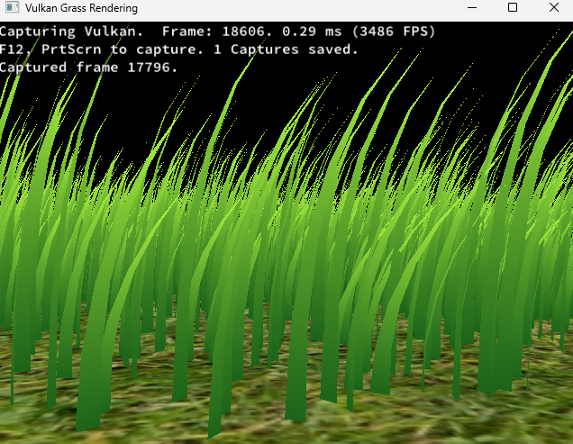

Vulkan Grass Rendering
==================================

**University of Pennsylvania, CIS 565: GPU Programming and Architecture, Project 5**

* Joanne Li
* Tested on: Windows 11, AMD Ryzen 5 7600X @ 4.70GHz 32GB, NVIDIA GeForce RTX 3070 Ti

  
*The gif takes some time to load*

## Overview
This project implements a **real-time grass** simulator and renderer using **Vulkan**. Each grass blade is represented by a Bezier curve. The project has 2 passes: 
- A compute pass, which simulates physics effects of the grass blades, and optimize performance by culling them. 
- A graphics pass, including a vertex shader that transforms Bezier control points, tessellation shaders that generate grass geometry, and a fragment shader that shades each blade.

## Features
### Basic Grass
  
In the compute pass, the grass blade buffer is sent to the compute shader for simulation. Then, this updated buffer is passed to the graphics pass. The vertex shader sends the data to the tessellation shader, which dynamically creates quads for each grass blade. Finally, the fragment shader shades the grass, coloring it based on its height to create a natural gradient effect.

### Force Simulation
The grass blades are affected by three forces:
- Gravity pulls the blades downward.
- Wind pushes the blades sideways. A 2D noise function is used to vary wind strength to add some variation.
- Recovery force helps the blades return to their upright position after being bent.

### Culling
  
*The gif takes some time to load*

To improve performance, several culling methods are implemented:
- Orientation culling removes blades facing away from the camera.
- View frustum culling excludes blades outside the camera’s view.
- Distance culling skips blades that are too far to be noticed.

### Performance Analysis

I compared the time per frame under different conditions: no culling, orientation culling, distance culling, frustum culling, and all three combined. Each method gave a clear performance boost, and combining all three achieved the best optimization, greatly reducing rendering time while keeping visual quality.

To capture the frame rate, I used RenderDoc to inject the program.

